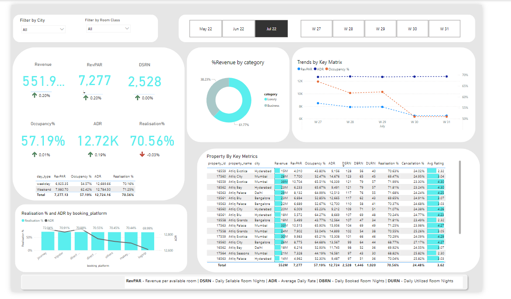

# Revenue-Intelligence-Dashboard-for-AtliQ-Grands-Hospitality

## Dataset Overview
This project analyzes data from multiple sources, consolidated into five CSV files:

### 1. `dim_date.csv`
Contains date-related information for analyzing bookings and trends over time.

**Columns:**
- `date`: Date for each entry (May, June, July).
- `mmm_yy`: Date in mmm yy format (e.g., May 20).
- `week_no`: Unique week number.
- `day_type`: Specifies if the day is a Weekday or Weekend.

### 2. `dim_hotels.csv`
Provides details on the hotel properties owned by AtliQ Grands.

**Columns:**
- `property_id`: Unique ID for each hotel.
- `property_name`: Name of the hotel.
- `category`: Class of the hotel (Luxury or Business).
- `city`: City where the hotel is located.

### 3. `dim_rooms.csv`
Describes room types and classifications.

**Columns:**
- `room_id`: Room type (RT1, RT2, RT3, RT4).
- `room_class`: Class of the room (Standard, Elite, Premium, Presidential).

### 4. `fact_aggregated_bookings.csv`
Aggregated booking data for occupancy and performance analysis.

**Columns:**
- `property_id`: Unique ID for each hotel.
- `check_in_date`: Date of customer check-in.
- `room_category`: Room type (RT1, RT2, RT3, RT4).
- `successful_bookings`: Number of successful bookings for the room type.
- `capacity`: Maximum room availability for the room type on that date.

### 5. `fact_bookings.csv`
Detailed transactional data for individual bookings.

**Columns:**
- `booking_id`: Unique booking identifier.
- `property_id`: Unique ID for the hotel.
- `booking_date`: Date of room booking.
- `check_in_date`: Date of customer check-in.
- `check_out_date`: Date of customer check-out.
- `no_guests`: Number of guests per booking.
- `room_category`: Room type (RT1, RT2, RT3, RT4).
- `booking_platform`: Platform used for booking (e.g., Online, Walk-in).
- `ratings_given`: Customer ratings for hotel services.
- `booking_status`: Status of the booking (Cancelled, Checked Out, No Show).
- `revenue_generated`: Amount generated from the booking.
- `revenue_realized`: Final revenue after booking status adjustments (e.g., cancellations result in a 40% deduction).

---

## Key Achievements

### 🔧 Project Highlights:
- ✔ Developed a suite of metrics aligning with stakeholder requirements.
- ✔ Designed and built a dashboard based on provided mock-ups, ensuring clear, data-driven insights.
- ✔ Discovered additional insights beyond the original scope, offering strategic recommendations to enhance revenue management.

---

## Insights and Learnings

### 🎓 Project Learnings:
This project provided a deep dive into the hospitality industry’s core revenue metrics and their strategic significance. Key takeaways include:

- **📈 RevPAR Analysis:** Gained a solid understanding of Revenue Per Available Room (RevPAR) and its importance in assessing hotel performance.
- **💡 Strategic Pricing Recommendations:** Utilized RevPAR to inform pricing strategies and benchmark hotel performance against competitors.
- **🔍 Room Utilization Metrics:** Employed metrics like DBRN (Daily Booked Room Nights), DSRN (Daily Sold Room Nights), and DURN (Daily Unoccupied Room Nights) to evaluate room utilization and occupancy patterns across properties.

---

## How to Use the Dashboard

- **Metrics Overview:** Key financial and operational metrics are presented to track booking performance and revenue trends.
- **Property Performance:** Compare hotels to identify high-performing and underperforming properties.
- **Room Utilization:** Get detailed insights into room occupancy rates, identifying opportunities for optimization.
- **Revenue Trends:** Track revenue generation and realization, highlighting areas for improvement and growth.

--- 

